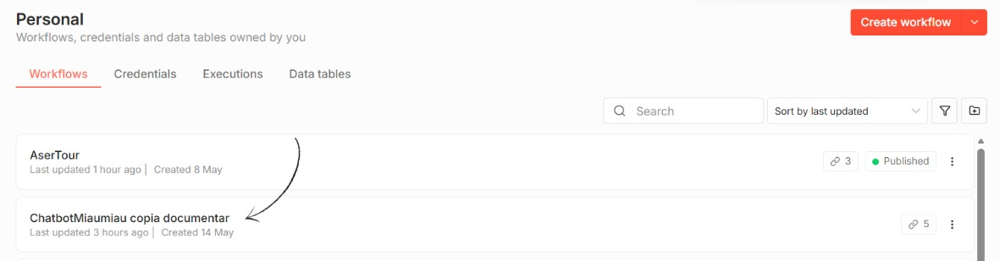
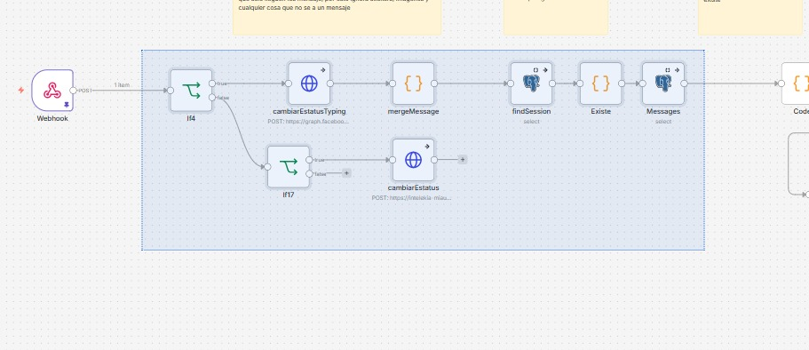
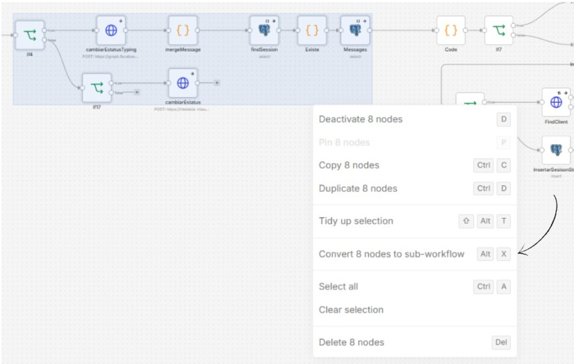
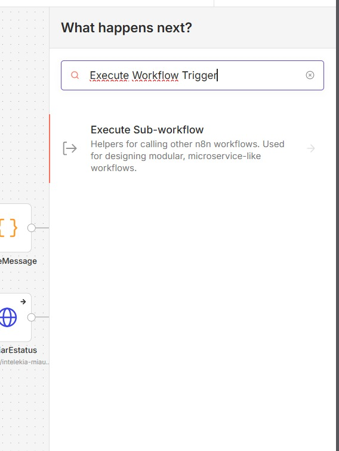
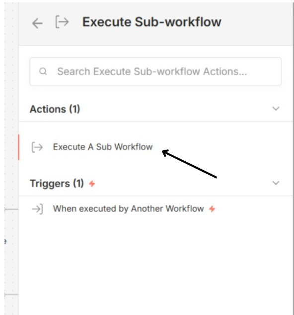
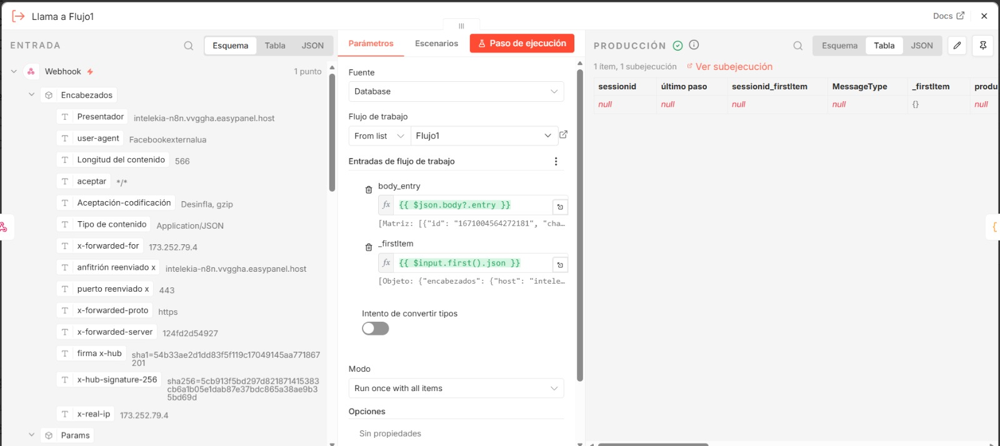
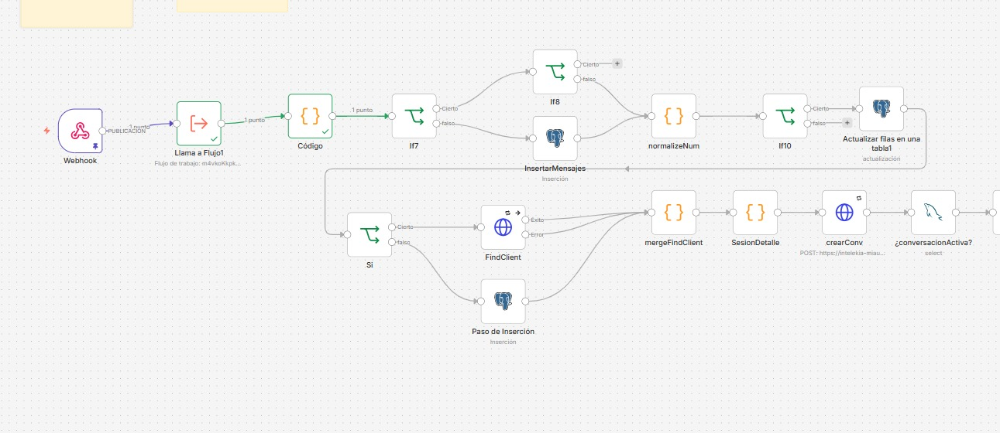

**MANUAL PARA DIVIDIR UN FLUJO COMPLEJO DE N8N EN SUBFLUJOS MODULARES.**

**¿Cómo dividir un flujo “spaguetti” de n8n en subflujos?**

Cuando un flujo de n8n crece demasiado se convierte en un “spaghetti” difícil de mantener, depurar y reutilizar. La solución es partirlo en flujos más pequeños (sub‑workflows) que se invocan entre sí. El n8n ofrece dos soluciones: conversión automática (rápida pero con restricciones) y creación manual (sin restricciones con control total).

**Ventajas principales:**

    - Mayor orden y legibilidad.
    - Detección rápida de errores (saber exactamente qué pieza falló).
    - Reutilización de lógica en otros flujos.
    - Posibilidad de ejecutar partes en paralelo.

**Conceptos clave antes de comenzar.**

    - Flujo padre: El workflow principal que llama a otros.
    - Subflujo: Un workflow independiente que realiza una tarea específica y es invocado desde otro flujo.
    - Nodo "Execute Workflow": Se coloca en el flujo padre para llamar a un subflujo.
    - Nodo "Execute Workflow Trigger": Es el único nodo que puede iniciar un subflujo. 
    Recibe los datos enviados por el padre y es la puerta de entrada del subflujo.

**Regla de oro:** Los disparadores (triggers) como Webhook, Schedule, Interval, etc. NUNCA pueden estar dentro de un subflujo. Siempre deben residir en el flujo principal.

**¿Qué nodos se pueden incluir en un subflujo?**

**Nodos permitidos.**

    - Puedes colocar dentro de un subflujo cualquier nodo de acción, lógica o integración:
    - Nodos de transformación: Set, Function, Code, Split In Batches, Merge, etc.
    - Nodos condicionales: IF, Switch.
    - Nodos de integración: HTTP Request, Slack, Google Sheets, Postgres, etc.
    - Nodos de control de flujo: Loop, Wait, NoOp.
    - El nodo Execute Workflow Trigger (obligatoriamente al inicio, y solo uno).

**Nodos no permitidos** 

    - Cualquier disparador (trigger) que inicie un workflow de forma autónoma:
    Webhook, Schedule, Interval, Email Trigger (IMAP), RabbitMQ Trigger, etc.
    - Un segundo Execute Workflow Trigger. Un subflujo solo puede tener uno, y debe ser el primer nodo.
    - Nodos que dependen exclusivamente de datos estáticos del flujo padre (ej. variables de entorno 
    propias del flujo) estos datos deben pasarse explícitamente como parámetros desde el padre.
    - Un subflujo siempre es invocado, nunca arranca por sí solo. Por eso no admite triggers propios. 
    Si necesitas una entrada externa (por ejemplo un webhook), el flujo padre debe recibirla y luego 
    llamar al subflujo.

**Conversión automática a subflujos**

Este método mueve un grupo de nodos seleccionados a un nuevo flujo y los sustituye por un nodo Execute Workflow que los invoca. Es rápido pero solo funciona si los nodos seleccionados forman un bloque cerrado, sin conexiones externas de entrada o salida.

**Paso a paso**
    
    - Abre el flujo "spaghetti" en el editor de n8n.

    - Selecciona los nodos que realizan una tarea concreta y que puedas aislar completamente
    (no deben recibir entradas desde nodos de fuera de la selección ni enviar salidas a nodos externos).

    - Haz clic derecho sobre la selección y elige "Convert to sub-workflow" 
    (también puedes usar el atajo Alt+X en Windows). El n8n automáticamente:

    - Crea un nuevo flujo con esos nodos, encabezados por un nodo Execute Workflow Trigger.
    Nota: lo puedes buscarlo en tu workflows

  

    - Selecciona Execute A Sub Workflow.

    - En el flujo original, reemplaza los nodos seleccionados por un nodo "Execute Workflow" ya configurado 
    para llamar al nuevo subflujo.

    Ya tienes tu flujo dividido. Puedes renombrar ambos flujos para identificarlos mejor.

**Paso de datos entre flujos**

    - Del padre al subflujo: En el nodo Execute Workflow del padre, configura el campo Input. Lo que pongas 
    ahí será recibido por el Execute Workflow Trigger del subflujo.
    - Dentro del subflujo: Los datos del padre están disponibles con la expresión {{ $input.first().json }} 
    (para el primer ítem). Puedes trabajar con ellos normalmente.
    - Del subflujo al padre: La salida del último nodo del subflujo es devuelta automáticamente al flujo 
    padre. En el padre, el nodo que sigue al Execute Workflow recibe ese resultado en {{ $json }}.

**Modos de ejecución: Síncrono vs Asíncrono.**

En el nodo Execute Workflow puedes decidir si el flujo padre espera o no a que el subflujo termine.

    - Síncrono (por defecto): El padre se pausa hasta que el subflujo acaba y recibe los resultados. 
    Ideal cuando necesitas esos datos para continuar.

    - Asíncrono (no esperar): Desmarca la opción "Wait for Sub-Workflow Completion". El padre lanza el 
    subflujo y sigue avanzando inmediatamente. Esto acelera procesos masivos (ejemplo: enviar cientos 
    de notificaciones) pero el padre no recibe automáticamente los resultados. Si los necesitas, 
    puedes hacer que el subflujo notifique por otra vía (webhook, actualización en base de datos, etc.).
